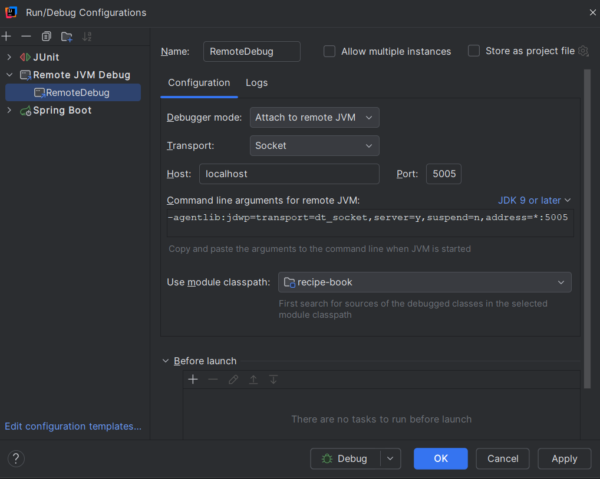

# Recipe Book API

A Spring Boot application for managing recipes.

## Table of Contents
- [Overview](#overview)
- [Getting Started](#getting-started)
  - [Prerequisites](#prerequisites)
  - [Running the Application](#running-the-application)
- [API Documentation](#api-documentation)
  - [Swagger UI](#swagger-ui)
  - [Endpoints](#endpoints)
- [Data Models](#data-models)

## Overview

Recipe Book is a RESTful API that allows users to create, retrieve, search, and delete recipes. Each recipe includes details such as name, description, ingredients, cooking time, and meal type.

## Getting Started

### Prerequisites

- Java 21
- Maven
- Docker (for running PostgreSQL)

### Running the Application

1. Clone the repository
2. Run the following command to start the application with DB
```bash
mvn clean package -DskipTests && docker-compose up --build
```
### Local Debugging

When you run the application in Docker you can remote debug the application. That means you create a new run configuration in your IDE (e.g., IntelliJ IDEA) to connect to the running Docker container.

### How to do that in IntelliJ?
- Click here to edit or add a run configuration.


After that click to the top left to add a new ```Remote JVM debug``` configuration.

If the port is not there or it is different then change it to 5005. The end result should look like this:

If you try to connect to it differently and you need the command line argument, here it is.

>-agentlib:jdwp=transport=dt_socket,server=y,suspend=n,address=*:5005

It should look like this at the end if you set it up in IntelliJ

Then connect your IDE to port 5005 and run it in debug mode.

## Trying it out
### Postman
You can do it with Postman or any other tool. The cool thing is that you can use the exported Postman collection which is in the project root directory. You can import it into Postman and try it out.
> The file name for the Postman collection is ```RecipeBook.postman_collection.json```

### Simple UI
I AI generated a Simple UI for the application. After you run the application you can access it at:
[Home Page](http://localhost:8080/)
> NOTE! If you just started the application I have to disappoint you. There won't be any recipes in the database. You can create them with the UI or use Postman to create them. The UI is just a simple way to test the API. But the faster way is Postman or a similar application. For this purpose I added a bulk create recipe endpoint. So you can easily try it out with more recipes.

### Swagger
You can also access the Swagger UI at:
[Swagger](http://localhost:8080/swagger-ui/index.html)

## API Documentation

### Swagger UI

The API documentation is available through Swagger UI. After starting the application, you can access it at:

```
http://localhost:8080/swagger-ui.html
```

### Endpoints

#### Get a Recipe by ID

```
GET /api/v1/recipes/{recipeId}
```

Retrieves a recipe based on the provided ID.

**Parameters:**
- `recipeId` (path parameter): ID of the recipe to retrieve

**Responses:**
- `200 OK`: Recipe found
  ```json
  {
    "id": 1,
    "name": "Spaghetti Carbonara",
    "description": "Classic Italian pasta dish",
    "ingredients": [
      {
        "name": "Spaghetti",
        "amount": 200,
        "unit": "g"
      },
      {
        "name": "Eggs",
        "amount": 2,
        "unit": "pcs"
      }
    ],
    "cookingTimeInMinutes": 20,
    "type": "DINNER"
  }
  ```
- `404 Not Found`: Recipe not found

#### Get a List of All Recipes

```
GET /api/v1/recipes/list
```

Returns a simplified list of all available recipes.

**Responses:**
- `200 OK`: List of recipes retrieved successfully
  ```json
  [
    {
      "id": 1,
      "name": "Spaghetti Carbonara",
      "cookingTimeInMinutes": 20,
      "type": "DINNER"
    },
    {
      "id": 2,
      "name": "Pancakes",
      "cookingTimeInMinutes": 15,
      "type": "BREAKFAST"
    }
  ]
  ```

#### Create a New Recipe

```
POST /api/v1/recipes
```

Creates a new recipe with the provided details.

**Request Body:**
```json
{
  "name": "Spaghetti Carbonara",
  "description": "Classic Italian pasta dish",
  "ingredients": [
    {
      "name": "Spaghetti",
      "amount": 200,
      "unit": "g"
    },
    {
      "name": "Eggs",
      "amount": 2,
      "unit": "pcs"
    }
  ],
  "cookingTimeInMinutes": 20,
  "type": "DINNER"
}
```

**Responses:**
- `201 Created`: Recipe created successfully
- `400 Bad Request`: Invalid input data

#### Delete a Recipe

```
DELETE /api/v1/recipes/{recipeId}
```

Deletes a recipe based on the provided ID.

**Parameters:**
- `recipeId` (path parameter): ID of the recipe to delete

**Responses:**
- `204 No Content`: Recipe deleted successfully
- `404 Not Found`: Recipe not found

#### Search for Recipes

```
GET /api/v1/recipes/search?searchExpression={searchExpression}
```

Searches for recipes based on the provided search expression.

**Parameters:**
- `searchExpression` (query parameter): Search expression to filter recipes

**Responses:**
- `200 OK`: Search results
  ```json
  [
    {
      "id": 1,
      "name": "Spaghetti Carbonara",
      "cookingTimeInMinutes": 20,
      "type": "DINNER"
    }
  ]
  ```

## Data Models

### Recipe

- `id`: Long - Unique identifier
- `name`: String - Name of the recipe
- `description`: String - Description of the recipe
- `ingredients`: List<Ingredient> - List of ingredients
- `cookingTimeInMinutes`: Integer - Cooking time in minutes
- `type`: MealType - Type of meal (BREAKFAST, LUNCH, DINNER)

### Ingredient

- `name`: String - Name of the ingredient
- `amount`: BigDecimal - Amount of the ingredient
- `unit`: String - Unit of measurement